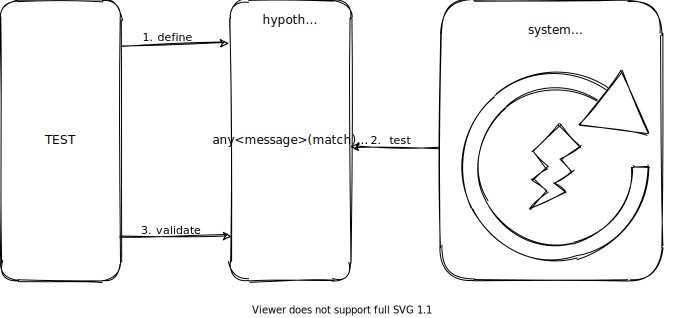

[](https://www.nuget.org/packages/Hypothesize/)

# Hypothesist

> The future assertion library for .NET.

This library is there to help you do assertions on events that are about to happen in the near future.
For example, when building integration tests for a subscriber on a service bus.



### Define

Define your hypothesis with an _experiment_, _time constraint_ and _test_:

```c#
var hypothesis = Hypothesize
    .Any<Data>()
    .Within(10.Seconds()) // <-- from FluentAssertions
    .Matches(x => x.Value == 1234);
```

### Test

You _test_ your _hypothesis_ by providing samples:

```c#
await hypothesis.Test(sample);
```

For example with an injected stub:

```c#
var service = Substitute.For<IDemoService>();
service
    .When(x => x.Demo(Arg.Any<Data>()))
    .Do(x => hypothesis.Test(x.Arg<Data>()));
```

### Validate

You _validate_ if your _hypothesis_ holds true for the supplied _samples_ during the specified _time window_.

```c#
await hypothesis.Validate();
```

But somewhere in between you've fired off the eventing mechanism that ultimately invokes the injected service.

## Experiments

The two parts of the hypothesis are the experiment and a time constraint.

### Any

Validates that _at least one_ item matches the assertion, meaning the experiment stops when this item is observed.

### Each

Validates that _each_ item that is observed during the experiment matches the assertion.

Remark: having no items observed during the time window also means the hypothesis holds true;

### First

Validates that _the first_ item that is observed matches the assertion.

### Single

Validates that _exactly one_ item is observed that matches the assertion.

Remark: having _other_ items _not matching_ the assert means the hypothesis still holds true.

### Exactly

Validates that _exactly_ the given number of _occurrences_ is observed that matches the assertion within the given timeframe.

### AtLeast

Validates that _at least_ the given number of _occurrences_ is observed that matches the assertion.

## Time

Since an experiment can only run for a certain period you have to specify the time constraint.

### Within

Specify the duration between each observation, meaning this is a sliding window which is reset on each observation.

### Forever

Let the experiment run forever or until you cancel the supplied cancellation token.

## Test

Just describe what you expect from the samples that are observed. Either by returning a boolean or throwing an exception.